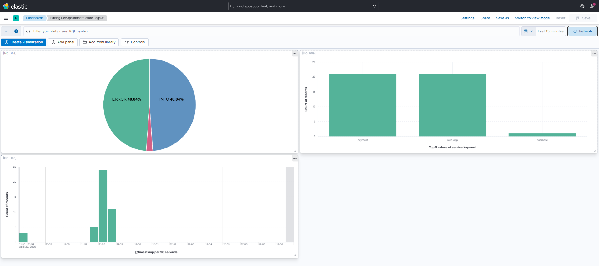
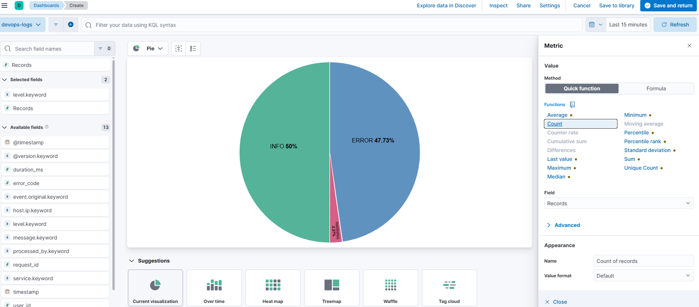

# DevOps Infrastructure Stack

> **Production-grade infrastructure automation** using Terraform, Ansible, ELK Stack, and HashiCorp Vault on GCP.
> Built as a portfolio project demonstrating end-to-end DevOps practices: IaC provisioning → configuration management → observability → secrets management → CI/CD.

---

## Architecture

```
┌─────────────────────────────────────────────────────────┐
│                     LOCAL MACHINE                        │
│                                                          │
│  ┌─────────────┐          ┌───────────────────────────┐ │
│  │  Terraform  │─────────▶│      GCP Infrastructure   │ │
│  │    (IaC)    │          │                           │ │
│  └─────────────┘          │  ┌─────────────────────┐  │ │
│                           │  │     VPC Network      │  │ │
│  ┌─────────────┐          │  ├─────────────────────┤  │ │
│  │   Ansible   │─────────▶│  │       Subnet         │  │ │
│  │  (Config)   │   SSH    │  ├─────────────────────┤  │ │
│  └─────────────┘          │  │  Firewall            │  │ │
│                           │  │  (22,80,443,5601,    │  │ │
│  ┌─────────────┐          │  │   9200,8200)         │  │ │
│  │   GitHub    │          │  ├─────────────────────┤  │ │
│  │   Actions   │          │  │   VM e2-medium       │  │ │
│  │   CI/CD     │          │  │   Ubuntu 22.04       │  │ │
│  └─────────────┘          │  └──────────┬──────────┘  │ │
│                           │             │              │ │
└───────────────────────────│  ┌──────────▼──────────┐  │ │
                            │  │      Docker          │  │ │
                            │  ├──────────────────────┤  │ │
                            │  │  Elasticsearch :9200 │  │ │
                            │  │  Logstash      :5044 │  │ │
                            │  │  Kibana        :5601 │  │ │
                            │  ├──────────────────────┤  │ │
                            │  │  HashiCorp Vault:8200│  │ │
                            │  └──────────────────────┘  │ │
                            └───────────────────────────--┘ │
```

---

## Stack

| Tool | Version | Purpose |
|------|---------|---------|
| **Terraform** | >= 1.5 | GCP infrastructure provisioning (VPC, Subnet, Firewall, VM) |
| **Ansible** | >= 2.9 | Server configuration, application deployment & security hardening |
| **Elasticsearch** | 8.13.0 | Log storage, indexing and search engine |
| **Logstash** | 8.13.0 | Log ingestion and processing pipeline |
| **Kibana** | 8.13.0 | Log visualization and dashboards |
| **HashiCorp Vault** | 1.16 | Secrets management (KV-v2, Shamir seal) |
| **Docker Compose** | v2 | Container orchestration on VM |
| **GitHub Actions** | — | CI/CD: Terraform validate, Ansible lint, tfsec security scan |
| **GCP** | — | Cloud provider (europe-central2 / Warsaw) |

---

## Prerequisites

- GCP account with billing enabled
- `gcloud` CLI installed and authenticated (`gcloud auth application-default login`)
- Terraform >= 1.5 installed
- Ansible >= 2.9 installed
- Ansible collections:
  ```bash
  ansible-galaxy collection install community.docker ansible.posix community.general
  ```
- SSH key pair at `~/.ssh/id_rsa` / `~/.ssh/id_rsa.pub`

---

## Quick Start

### 1. Clone the repository

```bash
git clone https://github.com/vikpl21/devops-infra-stack.git
cd devops-infra-stack
```

### 2. Enable GCP Compute Engine API

```bash
gcloud services enable compute.googleapis.com --project=YOUR_PROJECT_ID
```

### 3. Provision Infrastructure with Terraform

```bash
cd terraform/

# Create your variables file
cp terraform.tfvars.example terraform.tfvars
# Edit terraform.tfvars — set your GCP project_id

terraform init
terraform plan
terraform apply
```

Expected output:
```
Apply complete! Resources: 4 added, 0 changed, 0 destroyed.

Outputs:
instance_name = "devops-demo-vm"
public_ip     = "34.x.x.x"
ssh_command   = "ssh ubuntu@34.x.x.x"
```

### 4. Configure Server with Ansible

```bash
cd ../ansible/

# Create inventory from template
cp inventory/hosts.ini.example inventory/hosts.ini
# Edit hosts.ini — paste your VM public IP from terraform output

# Step 1: Install Docker
ansible-playbook -i inventory/hosts.ini playbooks/install_docker.yml

# Step 2: Deploy ELK Stack
ansible-playbook -i inventory/hosts.ini playbooks/install_elk.yml

# Step 3: Linux Security Hardening
ansible-playbook -i inventory/hosts.ini playbooks/harden_linux.yml

# Step 4: Deploy HashiCorp Vault
ansible-playbook -i inventory/hosts.ini playbooks/install_vault.yml
```

### 5. Initialize HashiCorp Vault

```bash
ssh ubuntu@YOUR_VM_IP

# Initialize Vault (run once only!)
docker exec vault vault operator init \
  -key-shares=3 \
  -key-threshold=2

# Save the Unseal Keys and Root Token securely!

# Unseal Vault (required after every restart)
docker exec vault vault operator unseal KEY_1
docker exec vault vault operator unseal KEY_2

# Login and create secrets
docker exec vault vault login ROOT_TOKEN
docker exec vault vault secrets enable -path=devops kv-v2
docker exec vault vault kv put devops/database \
  username="dbadmin" \
  password="your-secure-password"
```

### 6. Access Services

```bash
# Elasticsearch API
curl http://YOUR_VM_IP:9200

# Kibana UI
http://YOUR_VM_IP:5601

# Vault UI
http://YOUR_VM_IP:8200
```

---

## Project Structure

```
devops-infra-stack/
│
├── .github/
│   └── workflows/
│       └── ci.yml                # GitHub Actions: Terraform + Ansible lint + tfsec
│
├── terraform/
│   ├── main.tf                   # GCP resources: VPC, Subnet, Firewall, VM
│   ├── variables.tf              # Input variables with defaults
│   ├── outputs.tf                # Outputs: instance name, public IP, SSH command
│   ├── terraform.tfvars.example  # Template for project_id variable
│   └── .terraform.lock.hcl      # Provider version lock file
│
├── ansible/
│   ├── inventory/
│   │   └── hosts.ini.example     # Inventory template (copy and fill IP)
│   └── playbooks/
│       ├── install_docker.yml    # Install Docker CE + Docker Compose plugin
│       ├── install_elk.yml       # Deploy ELK Stack via Docker Compose
│       ├── harden_linux.yml      # Linux security hardening (SSH, UFW, Fail2ban, sysctl)
│       └── install_vault.yml     # Deploy HashiCorp Vault via Docker Compose
│
├── docs/
│   ├── kibana-dashboard.png      # Kibana dashboard screenshot
│   └── kibana-discover.png       # Kibana discover screenshot
│
└── README.md
```

---

## Infrastructure Details

| Parameter | Value |
|-----------|-------|
| Cloud Provider | GCP |
| Region | europe-central2 (Warsaw) |
| VM Type | e2-medium (2 vCPU, 4 GB RAM) |
| OS | Ubuntu 22.04 LTS |
| Disk | 20 GB |
| Network | Custom VPC + Subnet 10.0.1.0/24 |
| Firewall | TCP: 22, 80, 443, 5601, 9200, 8200 |

---

## Security Hardening (harden_linux.yml)

| Layer | Configuration |
|-------|--------------|
| **SSH** | Root login disabled, password auth disabled, MaxAuthTries 3 |
| **Firewall (UFW)** | Default deny incoming, allow only required ports |
| **Fail2ban** | SSH brute-force protection: ban after 3 attempts / 1 hour |
| **Kernel (sysctl)** | IP forwarding off, ICMP redirects off, SYN cookies on |
| **Updates** | Automatic security patches via unattended-upgrades |

---

## Secrets Management (HashiCorp Vault)

| Feature | Configuration |
|---------|--------------|
| **Seal type** | Shamir Secret Sharing (3 shares, threshold 2) |
| **Storage** | File backend (encrypted at rest) |
| **Secrets Engine** | KV-v2 (versioned key-value store) |
| **UI** | Enabled at :8200 |
| **TLS** | Disabled (dev mode — enable in production) |

> ⚠️ In production: enable TLS, use auto-unseal (GCP KMS), and integrate with Kubernetes via Vault Agent Injector.

---

## CI/CD Pipeline (GitHub Actions)

Every push to `main` triggers three parallel jobs:

```
┌─────────────────────────┐
│  Terraform Validate     │  ✅ fmt check + validate
├─────────────────────────┤
│  Ansible Lint           │  ✅ Production profile (FQCN, idempotency)
├─────────────────────────┤
│  Security Scan (tfsec)  │  ✅ Terraform security best practices
└─────────────────────────┘
```

---

## Key Concepts Demonstrated

- **Infrastructure as Code** — entire GCP infrastructure defined in `.tf` files; reproducible with one command
- **Idempotency** — Ansible playbooks can be re-run safely; no duplicate installations
- **Dependency graph** — Terraform resolves resource creation order automatically (VPC → Subnet → Firewall → VM)
- **Separation of concerns** — Terraform provisions infrastructure, Ansible configures it
- **Defense in depth** — SSH hardening + UFW firewall + Fail2ban + kernel hardening
- **Secrets management** — HashiCorp Vault with Shamir seal; secrets never stored in plaintext
- **Shift-left security** — tfsec scans Terraform code for security issues before apply

---

## Screenshots

### Kibana Dashboard — Log Analytics


### Kibana Discover — Log Stream


---

## Cost Management

Stop the VM when not in use to avoid unnecessary GCP charges:

```bash
# Stop VM (preserves disk and config)
gcloud compute instances stop devops-demo-vm \
  --zone=europe-central2-a --project=YOUR_PROJECT_ID

# Start VM again
gcloud compute instances start devops-demo-vm \
  --zone=europe-central2-a --project=YOUR_PROJECT_ID

# Check new public IP after start
cd terraform && terraform output public_ip
```

> ⚠️ Public IP may change after restart. Always verify with `terraform output public_ip`.
> ⚠️ After VM restart — Vault needs to be unsealed manually (2 of 3 keys required).

---

## Destroy Infrastructure

```bash
cd terraform/
terraform destroy
```

---

## Roadmap

- [x] Terraform: GCP VPC + VM provisioning
- [x] Ansible: Docker installation playbook
- [x] Ansible: ELK Stack deployment playbook
- [x] Ansible: Linux security hardening (SSH, UFW, Fail2ban, sysctl)
- [x] HashiCorp Vault: secrets management (KV-v2, Shamir seal)
- [x] GitHub Actions: CI/CD pipeline (Terraform validate, Ansible lint, tfsec)
- [ ] HashiCorp Vault: Kubernetes integration (Vault Agent Injector)
- [ ] Grafana: infrastructure monitoring dashboards
- [ ] Terraform: remote state backend (GCS bucket)
- [ ] Vault: auto-unseal via GCP KMS

---

## Author

DevOps Engineer | Linux | CI/CD | Cloud | GCP

[](https://github.com/vikpl21)

